# 👋 Yokso

### *Watashi No Github*

 

## 🧠 Currently learning — AI / ML

 

🌱 Beginner today, AI/ML Engineer in progress — learning one dataset at a time.

 

## 🌐 Find me here

.

 

## 👾 Pac-Man

Runs on its own, right here in the README — no click needed. It's a hand-built SVG animation, just to make profile interactive.

 

Want to actually *play* it yourself instead of watching it play? GitHub strips JavaScript out of README files, so a truly interactive game can't run on this page — but a full playable version (real keyboard controls, 4 ghosts with proper chase/scatter/frightened AI, lives, win/lose states) lives in this repo's [`pacman-game/`](./pacman-game/index.html) folder and runs live once GitHub Pages is turned on:

 

## 💭 About me

I'm just getting started on the path to becoming an **AI/ML Engineer** — right now that means daily reps with Python, wrangling data in Pandas and NumPy, plotting it with Matplotlib and Seaborn, training my first models with scikit-learn, and keeping the data itself organized in MySQL. Nothing fancy yet, just consistent practice, broken code, and slowly-clicking concepts.

When I'm not debugging a notebook, I'm probably watching anime — hence the guy up top who's always three steps ahead of everyone else. This repo is basically my corner of GitHub: part progress log, part playground, part proof that I can also make a ghost chase a yellow circle.

 

⚙️ Setup notes (for Yokso, not visitors)

 

**1. Replace the social links**
In `README.md`, swap `YOUR_LINKEDIN_URL_HERE`, `YOUR_INSTAGRAM_URL_HERE`, and `YOUR_X_URL_HERE` with your real profile URLs.

**2. Turn on GitHub Pages so the Pac-Man link works**
- Go to this repo's **Settings → Pages**
- Under "Build and deployment", set **Source** to `Deploy from a branch`
- Set **Branch** to `main` and folder to `/ (root)`, then **Save**
- After a minute, your game will be live at `https://YOUR-USERNAME.github.io/pacman-game/`

**3. Update the Pac-Man badge link**
In `README.md`, replace `YOUR-USERNAME` in the Pac-Man badge URL with your actual GitHub username.

That's it — the README updates instantly, the game deploys automatically on every push to `main`.

